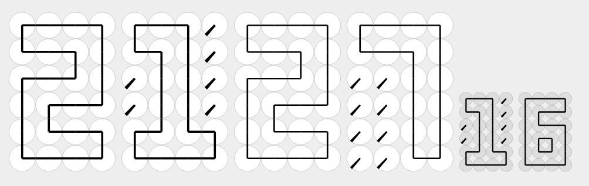
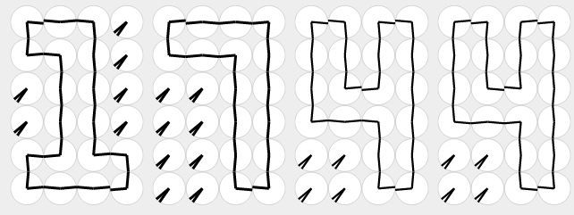
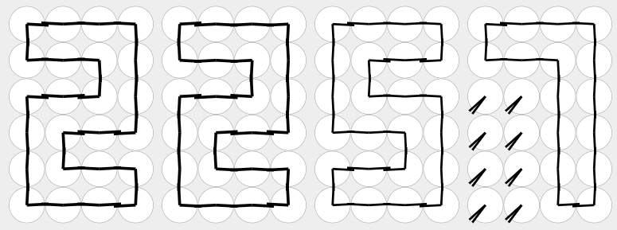

# analogue digital svg clock



This is a realtime clock that consists of 4 x 6 x 6 = 144 discs resembling clock faces. Each face has two "analogue" hands, making a total of 288 individual hands that move into place to form a digital representation of the current time.

Check it out here: https://lysebo.xyz/misc/svg-clock/

# original concept

The clock is inspired by the tech art project [A Million Times 120](https://www.humanssince1982.com/a-million-times-120) by Swedish/German art duo [Humans since 1982](https://www.humanssince1982.com/) in 2016.

I came across a video of this posted on Imgur with no credits or reference whatsoever. My first thought was: what a perfect thing to recreate using SVG, CSS animations and some JavaScript. <3

# description

The clock hands are SVG paths rotated in place by CSS transforms.
A change in time triggers a smooth transition of the affected hands.
Each digit is a grid of 4 x 6 clock faces inside a div container.
The digit container gets a corresponding number class, which controls the rotation of all child paths (hands).

A JavaScript function calculates which numbers to show, and sets the
corresponding number class for each of the 6 digits in the clock.
When a number class changes, the hands transition into place.

The digits responsible for showing seconds will rotate the shortest distance possible when there is a change. The digits showing minutes and hours rotate
at least one full round before settling in the correct position. To acommodate this I alternate between two sets of rotation classes, one in the range of
`[1, 360]` and one in the range of `[-1, -360]`. This is a little shortcut to avoid having to calculate the next value for each hand everytime there is a change.

# misc stuff

## file structure, render, zquery

I'm using a gulp based build system that compiles sass, includes variables defined in project.js, and many other things. There is a render function in project.js which makes it possible to pre-render data. In this case the `SVGDigit` variable, which is included once for every digit in the HTML page.

main.js includes zquery which is a tiny DOM access/manipulation library along the lines of jQuery.

These things are not included in this repo, but you get the idea.

## grid layout + aspect-ratio ftw

Using `display: grid` on the digits and experimenting with different fraction sizes was super easy! Also, `aspect-ratio` makes for hassle-free css. No need for percentage calculations or padding-bottoms.

## sass digits

I'm using a 2d sass array to define the direction of each clock hand for every digit,
and a function for generating the correct rotation transforms.

```
$digits: (
    r d u d u d u d u d u r   l r r d u d u d u r l r   l r l d u d u d u l l r   l d u d u d u d u d u l,
    r d u r x x x x r d u r   l r l d u d u d u l l r   l d u d u d u d u r l r   x x x x x x x x l d u l,
    r d u r r d u d u d u r   l r l r l r r d u r l r   l r l d u l l r l r l r   l d u d u d u l l d u l,
    r d u r x x x x r d u r   r l r l r d u r r l r l   r l l d u l l d u l l r   l d u d u d u d u d u l,
    r d u d u d u r x x x x   l d u d u r l r x x x x   r d u d u l l d u d u r   l d u d u d u d u d u l,
    r d u d u d u r r d u r   l r r d u r l r l r l r   l r l r l r l d u l l r   l d u l l d u d u d u l,
    r d u d u d u d u d u r   l r r d u r r d u r l r   l r l r l r l d u l l r   l d u l l d u d u d u l,
    r d u r x x x x x x x x   l r l r x x x x x x x x   l r l d u d u d u d u r   l d u d u d u d u d u l,
    r d u d u d u d u d u r   l r r d u r r d u r l r   l r l d u l l d u l l r   l d u d u d u d u d u l,
    r d u d u d u r x x x x   l r r d u r l r x x x x   l r l d u l l d u d u r   l d u d u d u d u d u l
);
```

r = right direction from origo  
l = left  
u = up  
d = down  
x = hand is not used

## kb size concern!

sass generates a lot of css for hand rotation. Approx 92 KB of this:

```
.digit div.d0 g path:nth-child(1) { transform: rotate(360deg); }
.digit div.d0 g path:nth-child(2) { transform: rotate(-270deg); }
.digit div.d0 g path:nth-child(3) { transform: rotate(270deg); }
.digit div.d0 g path:nth-child(4) { transform: rotate(-270deg); }
.digit div.d0 g path:nth-child(5) { transform: rotate(270deg); }
.digit div.d0 g path:nth-child(6) { transform: rotate(-270deg); }
.digit div.d0 g path:nth-child(7) { transform: rotate(270deg); }
.digit div.d0 g path:nth-child(8) { transform: rotate(-270deg); }
.digit div.d0 g path:nth-child(9) { transform: rotate(270deg); }

```

There are 960 individual hand positions
(4x6 clocks, x2 hands per clock, x10 digits, x2 for negative and positive rotation).

The additional `-webkit-transform()` fills up 32 KB alone!

The `nth-child()` selector for each clock hand is somewhat verbose.
Replacing `nth-child()` with a simple class identifier (`h1 - h48`) instead saves 7 KB, but I don't like to have class names for everything.

I'm pretty sure the clock would use far less KB if the rotation was calculated runtime and set as inline CSS on each hand. Still, I have a feeling that the browser performs better with predefined stuff rather than having to calculate everything all the time.

## water effect

Rotating the hands 5 degrees too much makes it look like the clock is under water.



## fluffy effect

Setting the paths larger than the face radius makes the clock look a little fluffy when the hands overlap.


